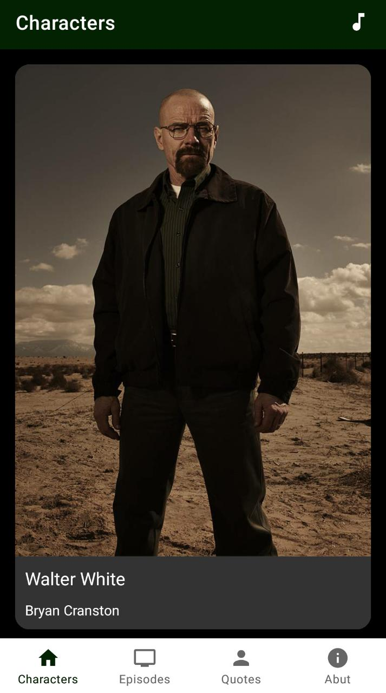
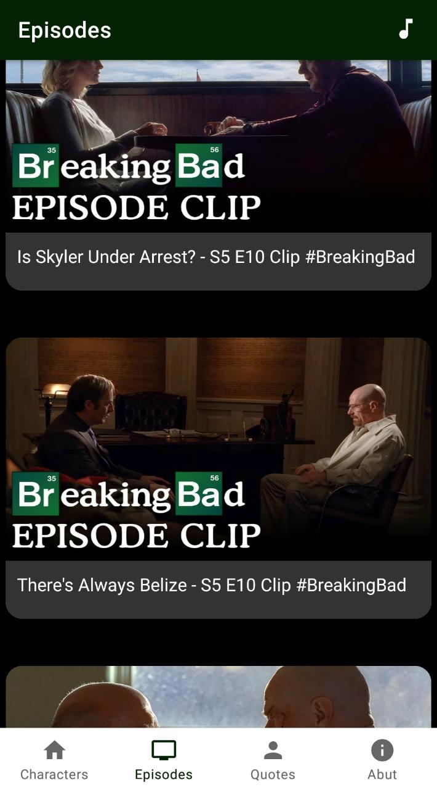
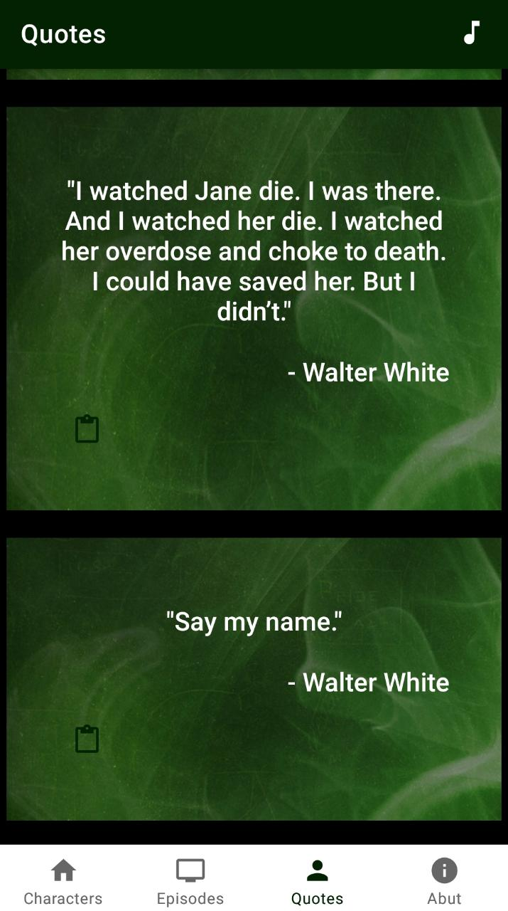

# TheBreakingBadApp (The one that rocks!)
### A fan made App for one of the greatest show of all time - Breaking Bad! ❤️ 

# About the App #
### An App made fully with Kotlin uses the  [ BreakingBadAPI ]( https://breakingbadapi.com ) 😎
### User can
- See details of the Characters.
- See quotes of the series and copy them to the clipboard.
- See clips from the Official Breaking Bad Youtube Channel.
- Can hear 'My baby blue' running in the background(can be toggled off and on.)

### Uses :

- Bottom Navigation Sheet
- Fragments
- Volley
- Glide

# Screenshots :  

  &nbsp;&nbsp;&nbsp;&nbsp;&nbsp;
  &nbsp;&nbsp;&nbsp;&nbsp;&nbsp;
  &nbsp;&nbsp;&nbsp;&nbsp;&nbsp;

# How to use it?
### Clone the repo , open it in Android Studio and try it out in your Physical Device or Emulator.

# How to contribute?
### Fork the repo , make changes and give a valid Pull Request.
